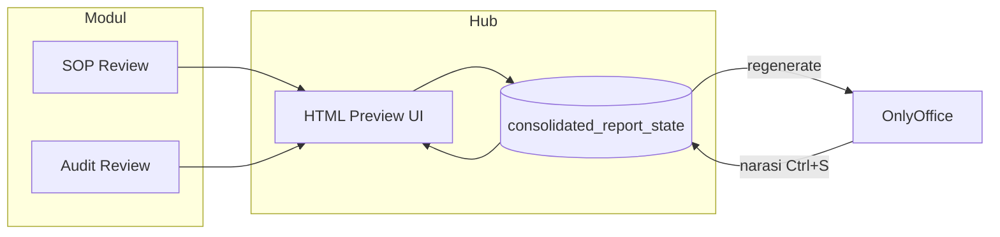

# KIAS Report Service — Arsitektur DOCX + ONLYOFFICE

Laporan konsolidasi (50–200 halaman, banyak tabel, lampiran) **tidak** di-render sebagai HTML → PDF di browser. Format utama adalah **DOCX**; ONLYOFFICE Docs dipakai untuk preview, edit, dan export PDF.

## Alur yang dipakai di KIAS

```
┌─────────────┐  ┌─────────────┐  ┌─────────────┐
│  SOP Review │  │ Audit Review│  │ Worksheet / │
│   Module    │  │   Module    │  │   lainnya   │
└──────┬──────┘  └──────┬──────┘  └──────┬──────┘
       │                │                │
       └────────────────┼────────────────┘
                        ▼
              ┌─────────────────────┐
              │ Report Service      │  ← `src/app/lib/report/reportService.js`
              │ (Next.js API)       │
              └──────────┬──────────┘
                         ▼
              ┌─────────────────────┐
              │ Generate DOCX       │  ← `docxjs` (default) atau `docxtemplater`
              └──────────┬──────────┘
                         ▼
              ┌─────────────────────┐
              │ Store File          │  ← `data/reports/{sessionId}.docx`
              └──────────┬──────────┘
                         ▼
              ┌─────────────────────┐
              │ ONLYOFFICE          │  ← `/Page/report/editor`
              │ Preview / Edit      │
              └──────────┬──────────┘
                         ▼
         ┌───────────────┴───────────────┐
         ▼                               ▼
  Download DOCX                    Export PDF
  `/api/report/documents/...`      (OnlyOffice convert, fallback LibreOffice)
```

## Dua opsi generate DOCX

### Opsi 1 — Template DOCX + Docxtemplater (praktis untuk tim non-dev)

1. Desain layout di Word / ONLYOFFICE (header, footer, page number otomatis).
2. Sisipkan placeholder, contoh:

   ```
   Company: {company_name}
   Assessment Date: {assessment_date}
   {#findings}
   Title: {title}
   Severity: {severity}
   {/findings}
   ```

3. Simpan sebagai `templates/report/consolidated/template.docx`.
4. Set di `.env`: `REPORT_DOCX_ENGINE=docxtemplater`

Library: [Docxtemplater](https://docxtemplater.com/) + PizZip.

**Keuntungan:** layout diatur auditor/template owner; tabel panjang pecah halaman sendiri di Word.

### Opsi 2 — Generate dari kode dengan docx.js (default KIAS hari ini)

- Implementasi: `src/app/lib/report/docx/templateBuilder.js`
- Cocok untuk struktur sangat dinamis (pagination per dept, chunk SOP/audit, executive summary HTML).

Set di `.env`: `REPORT_DOCX_ENGINE=docxjs` (default).

### Layout OnlyOffice (docxjs)

- Tabel **SOP** → halaman portrait, kolom fixed (DXA).
- Tabel **Audit Review** (11 kolom) → **landscape** per chunk, header baris diulang, font 6pt.
- SOP + audit di halaman preview yang sama → DOCX memecah: portrait (SOP) lalu landscape (audit) supaya tidak “hancur” di Word.
- Footer Word asli (`PAGE X of Y`), bukan teks di tengah halaman.

## Preview HTML = auto-generate dari hub

Setiap perubahan **OnlyOffice (Ctrl+S)** atau **modul (SOP / Audit lock)** menaikkan `hubRevision` di DB. Tab HTML preview memanggil `GET /api/report/hub/snapshot` (poll 2s + SSE) dan menerapkan ulang seluruh tampilan (narasi + tabel).

## Preview HTML = hub (seperti container GitHub)

| | HTML preview + `consolidated_report_state` | DOCX + ONLYOFFICE |
|---|---------------------------------------------|-------------------|
| Peran | **Container / source of truth** | View + edit Word + export PDF |
| Jalur `narrative` | ES, objectives, approach, conclusions, appendices | Ctrl+S → ekstrak ke hub (`onlyOfficeSyncRevision`) |
| Jalur `moduleTables` | Tabel SOP + Audit, lock/unlock (`moduleTablesRevision`) | Regenerate DOCX dari hub (narasi DB tidak ditimpa) |
| Realtime | SSE `/api/report/state-stream` + poll | `refreshFile` setelah `kias-report-modules-synced` |



Alur KIAS:

1. **Simpan ke hub** — Preview POST `/api/report/state` dengan `syncMode: moduleTablesOnly` bila narasi sudah dari OnlyOffice (`onlyOfficeSyncRevision > 0`). Server: `mergeReportStateForPersist` / `mergeModuleTablesIntoHub` di `reportPreviewHub.js`.
2. **OnlyOffice → hub** — Callback → `syncReportStateFromOnlyOffice` → naikkan `onlyOfficeSyncRevision` → broadcast SSE; tab preview hanya mengubah **jalur narasi** (bukan tabel modul).
3. **Modul → hub** — `loadFindings` / POST `/api/report/hub/sync-modules` (lock/unlock) → naikkan `moduleTablesRevision` → broadcast SSE; tab lain reload tabel dari API **tanpa** menimpa narasi.
4. **Hub → Word** — `regenerateReportDocxFromModules` memakai payload DB; narasi kosong diisi dari DOCX, yang sudah ada di DB tetap (`enrichRegeneratePayload`).

**Jangan** mengandalkan React → HTML → Puppeteer untuk laporan 50–200 halaman.

## API endpoints

| Method | Path | Fungsi |
|--------|------|--------|
| POST | `/api/report/session` | Generate DOCX + simpan + kembalikan `sessionId` + URL editor |
| GET | `/api/report/documents/[id]/file` | File DOCX untuk ONLYOFFICE |
| POST | `/api/report/onlyoffice/callback` | Simpan revisi dari editor |
| GET | `/api/report/documents/[id]/download?format=docx\|pdf` | Unduh setelah review |
| POST | `/api/report/export?format=docx\|pdf` | Unduh langsung tanpa session (fallback) |

## Environment (ONLYOFFICE)

```env
ONLYOFFICE_URL=http://localhost:8082
NEXT_PUBLIC_ONLYOFFICE_URL=http://localhost:8082
REPORT_DOCUMENT_HOST_URL=http://kias-doc-proxy:8888
REPORT_DOCX_ENGINE=docxjs
```

Lokal: `pnpm onlyoffice:up` lalu `pnpm dev`.

## Menambah modul baru ke pipeline

1. Modul mengirim data ke snapshot (seperti `buildReportExportPayload()` di preview).
2. Perluas `templateBuilder.js` atau field template Docxtemplater.
3. Tidak perlu mengubah alur ONLYOFFICE — hanya isi DOCX awal.

## File penting

| File | Peran |
|------|--------|
| `reportService.js` | Orkestrasi generate → store → session |
| `docx/generateReportDocx.js` | Pilih engine docxjs / docxtemplater |
| `docx/templateBuilder.js` | Opsi 2 — consolidated report |
| `docx/docxtemplaterEngine.js` | Opsi 1 — template Word |
| `documentStore.js` | Penyimpanan `data/reports/` |
| `onlyoffice/*` | Config editor, JWT, PDF convert |
| `exportReportClient.js` | Helper client |
| `reportPreviewHub.js` | Kontrak hub: jalur narasi vs moduleTables |
| `syncPreviewFromOnlyOffice.js` | OnlyOffice save → hub narasi |
| `useReportStateRealtime.js` | SSE/poll: narasi + moduleTables revision |
