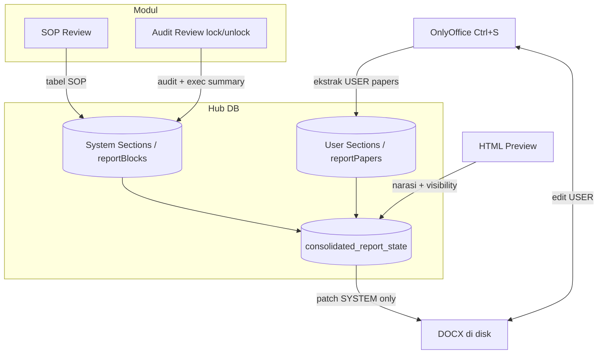

# KIAS Report — Database Source of Truth (2026-06)

Laporan konsolidasi: **database** adalah satu-satunya sumber kebenaran untuk data bisnis.
**OnlyOffice** = review, formatting minor, export DOCX/PDF — **bukan** penyimpan finding/recommendation/conclusion.

## Prinsip inti (keputusan arsitektur)

| Data | Sumber | Editor | Saat modul lock/unlock |
|------|--------|--------|------------------------|
| Executive Summary, Conclusion, Appendix | `consolidated_report_state` | HTML Preview | Tidak hilang (DB) |
| Finding & Recommendation (narasi) | `report_findings` | HTML Preview | Tidak hilang (DB) |
| Tabel SOP / Audit | Modul API | — | Visibility + regenerate DOCX |

**Alur generate (tidak ada patch/merge Word):**

```
Module APIs + report_findings + consolidated_report_state
        ↓
buildPayloadFromDb()
        ↓
Generate DOCX penuh (templateBuilder)
        ↓
OnlyOffice (view / Refresh Word)
```

**API:** `POST /api/report/refresh-docx` · `GET|POST /api/report/findings`

Registry: `reportSections.js` · `reportPapers.js` · `reportFindingsStore.js`

> Merge worker / KIASBLOCK patch **deprecated** — gunakan full regenerate dari DB.

---

## Peta section (KIAS)

```
Cover / front matter     → SYSTEM (template awal) + USER setelah diedit & disimpan
Executive Summary        → USER
Objectives & Scope       → USER
Approach & Methodology   → USER

Findings — teks bebas    → USER   (finding / recommendation narasi)
Findings — tabel SOP     → SYSTEM (modul SOP Review)
Findings — exec summary  → SYSTEM (modul Audit Review, lock/unlock)
Findings — tabel audit   → SYSTEM (modul Audit Review, lock/unlock)

Conclusion               → USER
Appendices               → USER (tabel evidence/asset terpisah → SYSTEM jika ditambah nanti)
```

Hanya **`findings_module_tables`** yang di-reset / di-patch saat Create Report, lock/unlock, atau SOP berubah.
Semua paper lain (`executive-summary`, `conclusion`, dll.) disimpan per bagian dari OnlyOffice.

---

## Marker di Word

Setiap block punya marker tersembunyi (sudah dipakai di generator):

```
KIASBLOCK_START_kias_sys_finding_finance_sop
... tabel SOP ...
KIASBLOCK_END_kias_sys_finding_finance_sop

KIASBLOCK_START_kias_user_narrative_executive_summary
... teks user ...
KIASBLOCK_END_kias_user_narrative_executive_summary
```

| Block ID | Jenis |
|----------|-------|
| `sys:finding:{dept}:sop` | SYSTEM |
| `sys:finding:{dept}:audit` | SYSTEM (lock) |
| `sys:finding:{dept}:exec-summary` | SYSTEM (lock) |
| `user:narrative:*` | USER |
| `user:conclusion:{dept}` | USER |
| `user:appendix:{id}` | USER |
| `user:note:{id}` | USER |

Engine: `docx/docxBlockEngine.js` · hapus/sisip hanya range marker SYSTEM.

DOCX lama tanpa marker → fallback `patchLegacyDeptVisibilityDocx.js` (anchor teks per dept).

---

## Alur data



### Kasus 1 — User menulis finding, modul asset/SOP berubah

- Finding / recommendation **tetap** (USER section)
- Tabel SOP / audit **ter-update** (SYSTEM section saja)

### Kasus 2 — User menulis 5 halaman analisis, modul lock/unlock

- 5 halaman analisis **tetap**
- Hanya tabel audit / exec summary dept yang tampil atau hilang

---

## Merge worker (Opsi 3 — arsitektur utama)

**Jangan** generate DOCX penuh saat modul berubah. **Ambil DOCX terakhir** yang diedit user di OnlyOffice, ganti **SYSTEM blocks saja**.

```
Module berubah / lock-unlock
        ↓
HTML Preview (hub DB — visibility + data modul utuh)
        ↓
OnlyOffice DOCX terakhir (shared-report-{year}.docx)
        ↓
reportMergeWorker.js
  1. readDocx(sessionId)
  2. collectUserTextOutsideSystemBlocks (fingerprint)
  3. buildReportDocxBuffer → fragmen SYSTEM baru
  4. deleteDocxBlocks + insertSystemBlockFromSource
  5. verifyUserTextPreserved
  6. saveDocx + bumpDocumentKeyAfterServerPatch
        ↓
OnlyOffice refresh (key / ?v=saveCount)
```

Implementasi: `src/app/lib/report/reportMergeWorker.js`

| Trigger | Source constant | Entry |
|---------|-----------------|-------|
| Lock/unlock | `MERGE_JOB_SOURCE.VISIBILITY` | `syncPublishVisibilityToDocx` → `runReportMergeJob` |
| SOP/audit data | `MERGE_JOB_SOURCE.MODULE_TABLES` | `regenerateFindingsPaperInDocx` → `runReportMergeJob` |
| Manual / API | `MERGE_JOB_SOURCE.MANUAL` | `POST /api/report/merge-system-blocks` |

**Marker** (lebih aman dari `[[TEXT]]` biasa — user bisa hapus teks):

```
KIASBLOCK_START_kias_sys_finding_finance_audit
… tabel audit (OOXML) …
KIASBLOCK_END_kias_sys_finding_finance_audit
```

+ bookmark Word `kias_sys_finding_finance_audit` (di-inject saat Create Report).

DOCX **legacy tanpa marker** → `patchMode: "hub-only"` (HTML preview saja; Word tidak diubah).

**Antrian (opsional nanti):** BullMQ `report-merge-worker` — job payload sama dengan `runReportMergeJob`.

---

## Lock / unlock (Audit Review)

1. Update hub: `auditVisibleByDept` saja — **jangan hapus** `auditRows` di DB
2. HTML preview: filter tampilan (`effectivePublishByDept`)
3. Word: merge worker — hapus/sisip **hanya** block SYSTEM dept tersebut (jika ada marker)
4. **Tidak** regenerate narasi, conclusion, appendices

---

## Penyimpanan (hari ini vs target DB)

Hari ini semua di `consolidated_report_state` + `reportPapers` (JSON).

Target relasional (opsional):

```sql
report_sections
---------------
id
report_year
section_key      -- executive_summary, findings_module_tables, ...
source_type      -- user | system
content          -- JSON / HTML
revision
updated_at
```

Mapping field lama → `section_key` ada di `reportSections.js` (`legacyField`, `paperId`).

---

## API & file penting

| File | Peran |
|------|--------|
| `reportSections.js` | Registry USER vs SYSTEM |
| `reportPapers.js` | Save per paper (user only) |
| `reportBlocks.js` | Manifest block SYSTEM findings |
| `syncPublishVisibilityToDocx.js` | Lock/unlock → patch Word |
| `reportMergeWorker.js` | **Merge worker** — patch SYSTEM di DOCX user |
| `patchVisibilityOnlyDocx.js` | Wrapper visibility → merge worker |
| `patchLegacyDeptVisibilityDocx.js` | Patch DOCX tanpa marker (tidak aktif) |
| `regenerateFindingsPaper.js` | Wrapper module tables → merge worker |
| `syncPreviewFromOnlyOffice.js` | OnlyOffice → USER papers |
| `buildPayloadFromPapers.js` | Render: USER dari DB + SYSTEM dari modul |

| Endpoint | Peran |
|----------|-------|
| POST `/api/audit-review/publish-notify` | Lock/unlock → hub + Word visibility |
| POST `/api/report/hub/sync-modules` | SOP berubah → hub (tanpa replace narasi) |
| POST `/api/report/merge-system-blocks` | Merge worker manual (patch SYSTEM di Word) |
| POST `/api/report/session` | Create report (`resetFindingsOnly`) |
| OnlyOffice callback | Ctrl+S → USER papers |

---

## Environment

```env
ONLYOFFICE_URL=http://localhost:8082
REPORT_DOCUMENT_HOST_URL=http://kias-doc-proxy:8888
REPORT_DOCX_ENGINE=docxjs
```

Lokal: `pnpm onlyoffice:up` · `pnpm dev`

---

## Yang dihindari

1. Full rebuild DOCX pada lock/unlock (hanya patch SYSTEM)
2. `fetchBatchStatus` menimpa unlock optimistic sebelum DB selesai
3. Merge preserved findings yang mengembalikan audit rows setelah unlock
4. Event `kias-report-modules-synced` memicu regen Word saat lock/unlock (hanya saat SOP berubah)
